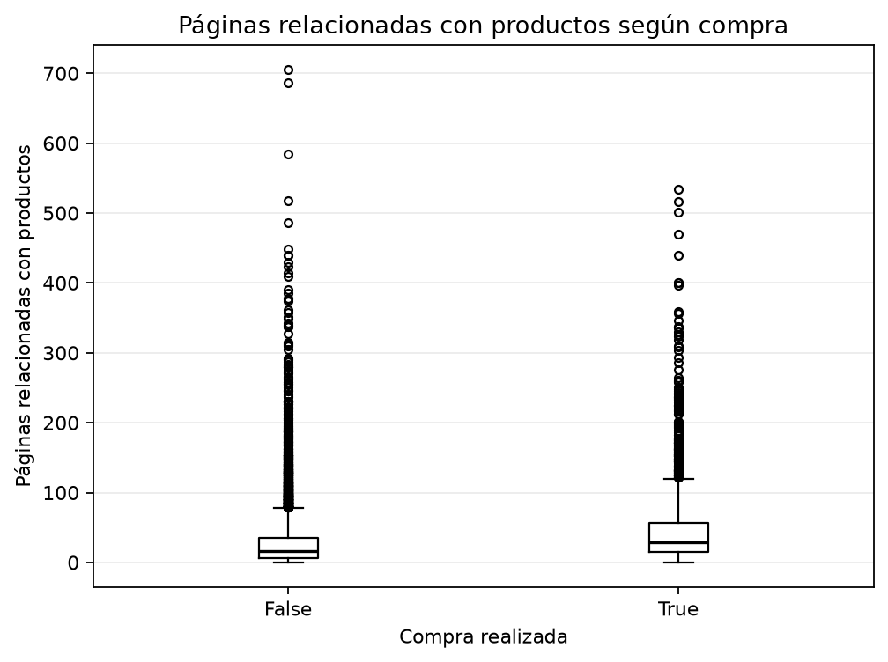
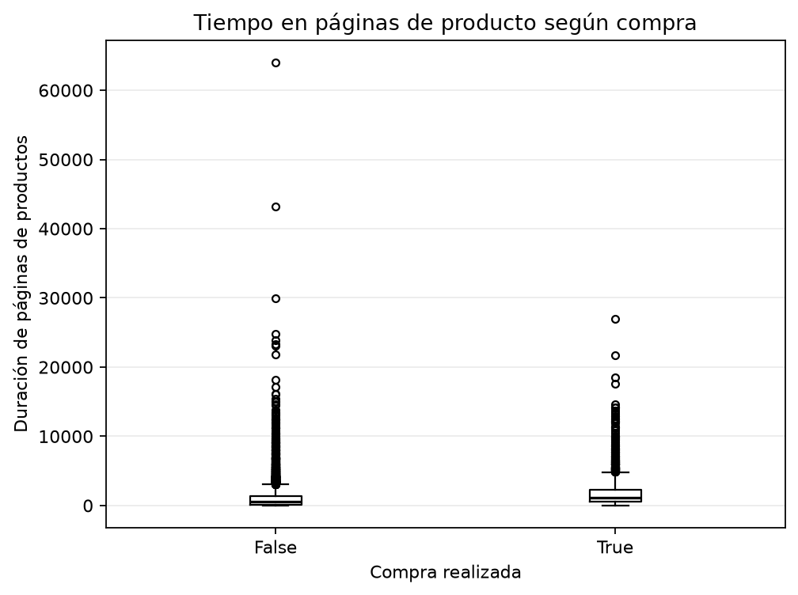
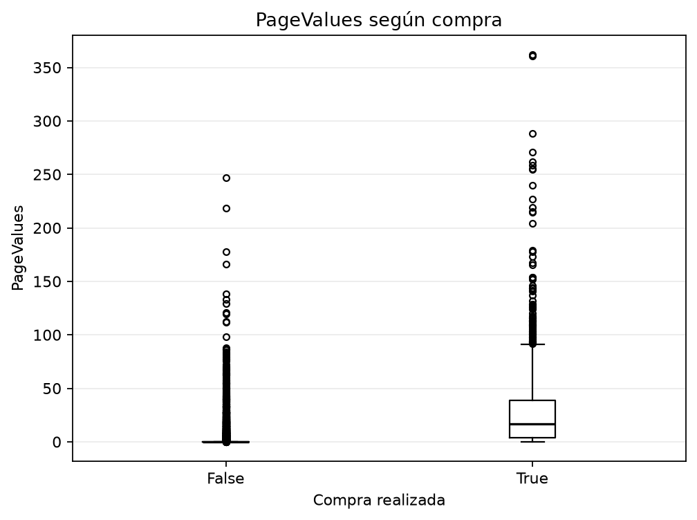
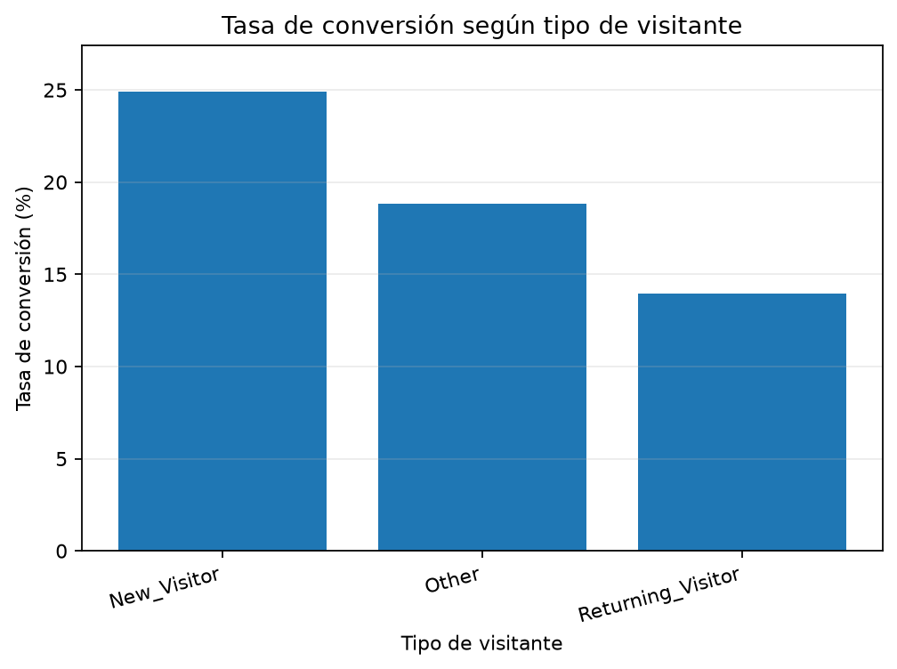
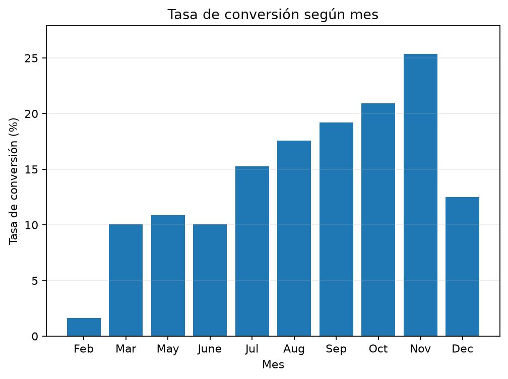

# Proyecto 01: Análisis y predicción de intención de compra en sesiones de comercio electrónico

## Estado actual

**Primer hito analítico y baseline predictivo completados.** Se verificó el CSV, se generaron cinco visualizaciones reproducibles y se compararon un baseline de clase mayoritaria y dos pipelines de regresión logística. El proyecto permanece abierto a revisión y futuras validaciones; no se declara terminado.

## Descripción y motivación

Este proyecto estudiará sesiones de navegación en un contexto de comercio electrónico y el resultado observado de cada sesión: si terminó o no en una compra. El interés está en conectar comportamientos de navegación, características contextuales de la visita y conversión, manteniendo una metodología comprensible y reproducible.

La motivación es doble:

- comprender qué señales de una sesión están asociadas con una compra observada;
- evaluar, con modelos simples e interpretables, hasta qué punto puede anticiparse ese resultado sin presentar la predicción como una explicación causal ni como una solución productiva.

El proyecto forma parte del laboratorio público `data-ai-lab`, cuyo principio es aprender construyendo, demostrar comprendiendo y documentar para evolucionar.

## Antecedente académico

Anteriormente utilicé este dataset como parte de una actividad universitaria guiada relacionada con Machine Learning, principalmente mediante KNIME. Este proyecto no republica aquella evaluación ni reutiliza sus resultados como si fueran evidencia nueva. Retomo el dataset de forma independiente para profundizar su análisis e implementación mediante Python, por lo que las decisiones de adquisición, auditoría, preparación, evaluación e interpretación deberán justificarse nuevamente.

## Problema y pregunta central

El problema de trabajo es comprender y evaluar la capacidad de utilizar información disponible durante una sesión de comercio electrónico para distinguir entre sesiones que terminan en una compra y sesiones que no terminan en una compra.

**Pregunta central:**

> ¿Qué comportamientos observados durante una sesión de comercio electrónico están asociados con una compra y hasta qué punto puede predecirse la conversión utilizando modelos simples e interpretables?

La palabra “asociados” es deliberada: el proyecto no asumirá que una relación observada sea causal. Del mismo modo, `Revenue` representa un resultado observado de la sesión; no se tratará automáticamente como una medición completa de una intención psicológica no observada.

## Objetivos

### Objetivo general

Comprender la relación entre las características documentadas de una sesión de comercio electrónico y su resultado de compra, y evaluar de forma reproducible y crítica el desempeño de modelos simples e interpretables para predecir ese resultado.

### Objetivos específicos

1. Documentar la procedencia, las condiciones de uso, la estructura declarada y el significado de las variables del dataset.
2. Auditar empíricamente la calidad, los tipos, los valores faltantes, los duplicados, los rangos y las inconsistencias del archivo antes de tomar decisiones de preparación.
3. Explorar las diferencias y asociaciones entre las variables de sesión y el resultado `Revenue`, utilizando visualizaciones y resúmenes adecuados.
4. Establecer un baseline explícito, incluyendo una referencia basada en la clase mayoritaria, antes de comparar modelos.
5. Preparar los datos y separar entrenamiento y prueba de manera reproducible, justificando las decisiones que puedan afectar la evaluación.
6. Comparar un conjunto pequeño de modelos de clasificación simples, priorizando la comprensión y la interpretabilidad por sobre la cantidad de algoritmos.
7. Evaluar el desempeño con métricas apropiadas para la distribución de clases y analizar la matriz de confusión y los tipos de error.
8. Interpretar los resultados sin sobreextenderlos, distinguiendo asociación, capacidad predictiva y posibles implicaciones de negocio.
9. Documentar las limitaciones del dataset, del diseño de evaluación y de cualquier inferencia realizada.
10. Dejar un flujo reproducible, con dependencias declaradas, rutas relativas y documentación suficiente para repetir el trabajo.

## Dataset previsto

### Identidad y fuente primaria

- **Nombre oficial:** Online Shoppers Purchasing Intention Dataset.
- **Repositorio institucional:** UCI Machine Learning Repository.
- **Identificador UCI:** 468.
- **Fuente primaria:** [ficha oficial del dataset en UCI](https://archive.ics.uci.edu/dataset/468/online%2Bshoppers%2Bpurchasing%2Bintention%2Bdataset).
- **DOI:** [10.24432/C5F88Q](https://doi.org/10.24432/C5F88Q).
- **Creadores indicados por UCI:** C. Sakar y Yomi Kastro.
- **Cita indicada por UCI:** Sakar, C. & Kastro, Y. (2018). *Online Shoppers Purchasing Intention Dataset*. UCI Machine Learning Repository.

La ficha oficial declara 12.330 instancias, 17 características, un área temática de negocios, tareas asociadas de clasificación y clustering, y ausencia de valores faltantes declarados. UCI también informa 10.422 sesiones de clase negativa (84,5 %) y 1.908 de clase positiva. Además, indica que las instancias representan sesiones pertenecientes a usuarios distintos dentro de un período de un año, según la descripción del repositorio. La ejecución confirmó la forma, la ausencia de valores faltantes y la distribución original de `Revenue`; las decisiones de modelado se basan en una copia en memoria y no alteran el archivo fuente.

### Variables documentadas oficialmente

La ficha de UCI documenta `Revenue` como etiqueta de clase y describe las siguientes variables de sesión:

- `Administrative`, `Administrative_Duration`;
- `Informational`, `Informational_Duration`;
- `ProductRelated`, `ProductRelated_Duration`;
- `BounceRates`, `ExitRates`, `PageValues`, `SpecialDay`;
- `Month`, `OperatingSystems`, `Browser`, `Region`, `TrafficType`;
- `VisitorType`, `Weekend`;
- `Revenue` como resultado objetivo.

La fuente describe conteos y duraciones de páginas administrativas, informativas y de productos; métricas de Google Analytics como `BounceRates`, `ExitRates` y `PageValues`; cercanía a días especiales mediante `SpecialDay`; y variables contextuales como sistema operativo, navegador, región, tipo de tráfico, tipo de visitante, mes y fin de semana.

La auditoría mínima del experimento confirmó que el archivo local corresponde a estas columnas, tiene 12.330 filas y 18 columnas, y no contiene valores faltantes. El CSV original permanece intacto; la eliminación de duplicados se aplicó únicamente a la copia en memoria destinada al modelado.

### Licencia y uso

UCI indica que el dataset está disponible bajo [Creative Commons Attribution 4.0 International (CC BY 4.0)](https://creativecommons.org/licenses/by/4.0/). El uso del dataset deberá conservar la atribución correspondiente a sus creadores y a UCI. La cita, la URL de la fuente, el DOI, la fecha de adquisición y, cuando corresponda, una suma de comprobación del archivo se registrarán en la documentación de la etapa de adquisición.

Existe una copia local en `datasets/online_shoppers_intention.csv`, pero permanece sin seguimiento de Git y no forma parte de ningún commit. La decisión sobre su publicación permanente se mantiene pendiente.

### Riesgos conceptuales a revisar

`PageValues` se describe oficialmente como el valor promedio de una página visitada antes de completar una transacción. En este experimento su inclusión mejoró las métricas observadas, pero todavía debe revisarse si representa información disponible en el momento real de la predicción o si está demasiado cerca del resultado. Esto no permite afirmar leakage ni causalidad.

## Preguntas analíticas

Las preguntas fueron revisadas contra las variables descritas por UCI. Se conservarán como guía, no como promesas de resultados:

1. ¿Qué diferencias presentan las variables de comportamiento de sesión entre sesiones con `Revenue` positivo y sesiones sin compra observada?
2. ¿Cómo se relacionan los conteos, las duraciones y las métricas de navegación con la conversión observada?
3. ¿Qué relación descriptiva existe entre `PageValues` y `Revenue`, y qué implicaciones tiene su disponibilidad temporal para la predicción?
4. ¿Existen patrones de conversión asociados con `VisitorType`?
5. ¿Cambian las tasas de conversión observadas según `Month`?
6. ¿Existen diferencias entre sesiones de días de semana y de fin de semana mediante `Weekend`?
7. ¿Qué variables aportan información predictiva en modelos simples, y cómo cambia esa interpretación según el preprocesamiento?
8. ¿Qué tan difícil es superar un baseline basado en la clase mayoritaria?
9. ¿Qué métricas permiten evaluar responsablemente el desempeño si la clase positiva es menos frecuente?
10. ¿Qué tipos de errores podrían ser más relevantes para una decisión de negocio y qué supuestos se necesitarían para discutirlos?

Todas las preguntas quedan abiertas. En particular, ninguna anticipa que una variable sea importante, que un mes convierta mejor o que un modelo supere el baseline.

## Alcance

El proyecto global podrá incluir, de forma progresiva:

1. adquisición reproducible y documentación de la fuente;
2. auditoría de identidad, calidad y estructura;
3. limpieza y preparación justificadas;
4. análisis exploratorio y visualización;
5. definición de un baseline y una estrategia de separación entrenamiento/prueba;
6. preprocesamiento y entrenamiento de modelos simples de clasificación;
7. comparación, evaluación e interpretación de errores;
8. conclusiones, limitaciones e implicaciones prudentes;
9. documentación de reproducibilidad.

Este alcance describe el proyecto completo. El diseño e inicialización documental fueron la base del proyecto; este hito añade una primera auditoría reproducible, visualizaciones y una medición predictiva inicial, sin declarar terminado el proyecto global.

## Fuera de alcance inicial

Quedan fuera del alcance inicial, salvo una justificación posterior basada en una necesidad concreta:

- deep learning y redes neuronales;
- LLM y sistemas multiagente;
- APIs productivas y despliegue cloud;
- Kubernetes, microservicios y MLOps completo;
- dashboards complejos;
- optimización exhaustiva de hiperparámetros;
- evaluación de grandes cantidades de modelos sin una razón analítica;
- afirmaciones de causalidad, personalización en tiempo real o impacto comercial medido;
- convertir el proyecto en una réplica de la actividad académica previa.

## Metodología prevista

La secuencia prevista es deliberadamente gradual:

1. **Adquisición y trazabilidad:** registrar la fuente UCI, la licencia, la fecha de descarga, el nombre del archivo y la versión o checksum que corresponda.
2. **Auditoría:** comprobar identidad, columnas, tipos, valores faltantes, duplicados, cardinalidades, rangos y distribución del objetivo sin ocultar incidencias.
3. **Preparación:** documentar cualquier conversión, codificación, tratamiento de valores o exclusión; evitar decisiones que filtren información del conjunto de prueba.
4. **Exploración:** describir la distribución de las sesiones, comparar grupos por `Revenue`, examinar las preguntas analíticas y visualizar solo lo que ayude a responderlas.
5. **Baseline y partición:** definir una referencia de clase mayoritaria y una separación reproducible antes de interpretar modelos.
6. **Modelado simple:** evaluar pocos clasificadores interpretables, por ejemplo un modelo lineal y un árbol acotado, únicamente si la auditoría y la preparación los justifican.
7. **Evaluación e interpretación:** comparar con el baseline, revisar matriz de confusión, precision, recall, F1, ROC-AUC o PR-AUC cuando sean pertinentes, y explicar qué significa cada resultado.
8. **Cierre:** analizar errores, limitaciones, implicaciones y capacidad de reproducción; vincular cada conclusión con evidencia realmente obtenida.

La metodología podrá ajustarse si la auditoría descubre restricciones del archivo, pero cualquier cambio deberá quedar documentado. La ejecución realizada en esta etapa se limita al baseline, la regresión logística y la comparación controlada descrita a continuación.

## Principios de evaluación futura

- El baseline será explícito y servirá como referencia mínima.
- `accuracy` no será suficiente por sí sola si la distribución de clases está desbalanceada.
- Las métricas se elegirán según la pregunta, los costos relativos de los errores y las limitaciones del diseño.
- Una cifra superior no bastará para seleccionar un modelo: también se considerarán interpretabilidad, estabilidad, errores y reproducibilidad.
- La evaluación distinguirá desempeño predictivo de explicación causal.
- La inclusión de variables como `PageValues` se revisará considerando el momento en que estarían disponibles.

## Auditoría inicial

La ejecución reproducible confirmó:

- shape original: `12.330 filas x 18 columnas`;
- valores faltantes: `0`;
- repeticiones posteriores: `125`;
- filas involucradas en grupos repetidos: `201`;
- patrones repetidos: `76`;
- `Revenue=False`: `10.422` sesiones (`84.5255 %`);
- `Revenue=True`: `1.908` sesiones (`15.4745 %`).

El CSV original permanece intacto. Para el experimento de Machine Learning se conservaron `12.205` filas después de eliminar únicamente las apariciones duplicadas posteriores en memoria. `Revenue=True` permaneció en `1.908`, mientras `Revenue=False` pasó de `10.422` a `10.297`; por ello la prevalencia positiva cambia ligeramente. No se demostró que las filas repetidas fueran errores.

## EDA reproducible

El script [`eda_summary.py`](src/eda_summary.py) lee el archivo local mediante una ruta derivada del repositorio y genera cinco figuras. El resumen numérico reproducible está en [`eda_summary.json`](outputs/eda_summary.json).

### Comportamiento de navegación



Las sesiones con compra presentan una mediana y una media mayores de `ProductRelated` (`29` y `48.2102`) que las sesiones sin compra (`16` y `28.7146`). Esto describe una asociación observada, no una relación causal.



`ProductRelated_Duration` también presenta valores centrales mayores en las sesiones con compra: mediana `1109.9063` y media `1876.2096`, frente a mediana `510.19` y media `1069.9878`.



`PageValues` muestra una separación especialmente marcada: la mediana es `0` para sesiones sin compra y `16.7581` para sesiones con compra. Su disponibilidad temporal sigue requiriendo revisión antes de interpretar esta señal en un escenario real.

### Categorías y conversión



La tasa observada fue `13.9323 %` para `Returning_Visitor`, `24.9115 %` para `New_Visitor` y `18.8235 %` para `Other`. `Other` se reporta como categoría existente; no se le atribuye un significado adicional.



La figura usa únicamente meses presentes en el archivo y conserva el orden `Feb`, `Mar`, `May`, `June`, `Jul`, `Aug`, `Sep`, `Oct`, `Nov`, `Dec`. `Nov` tuvo la mayor tasa observada (`25.3502 %`) y `Feb` la menor (`1.6304 %`); esto no demuestra causalidad estacional.

También se verificó una diferencia observada entre `Weekend=False` (`14.8911 %`) y `Weekend=True` (`17.3989 %`). Estos porcentajes no deben interpretarse como efecto causal del día de visita.

## Primer experimento de Machine Learning

### Diseño implementado

- **Objetivo:** `y = Revenue`, con `Revenue=True` como clase positiva.
- **Preparación:** se conservaron 12.330 filas originales; se eliminaron 125 apariciones duplicadas posteriores solo en memoria; se utilizaron 12.205 filas para Machine Learning.
- **Duplicados:** se observaron 201 filas involucradas en patrones repetidos y 76 patrones únicos repetidos. Esta decisión metodológica no afirma que las sesiones repetidas sean errores.
- **Split:** 80 % entrenamiento y 20 % prueba, estratificado, `random_state=42`. Train contiene 9.764 filas y test 2.441.
- **Preprocesamiento:** `StandardScaler` para variables numéricas, `OneHotEncoder(handle_unknown="ignore")` para variables categóricas, integrados mediante `ColumnTransformer` y `Pipeline`.
- **Baseline:** `DummyClassifier(strategy="most_frequent")`, ajustado únicamente con train.
- **Modelo:** `LogisticRegression(max_iter=1000, random_state=42)`, sin `class_weight="balanced"`, sin tuning y sin búsqueda de hiperparámetros.

Las variables numéricas fueron las definidas en el diseño inicial. `Month`, `OperatingSystems`, `Browser`, `Region`, `TrafficType`, `VisitorType` y `Weekend` se trataron como categóricas, sin imponer ordinalidad a sus códigos. El Experimento A excluye `PageValues`; el Experimento B la agrega como variable numérica. Ambos reutilizan el mismo split y el mismo pipeline.

### Distribución de train/test

Después de eliminar duplicados para el modelado quedó `False=10.297 (84.3671 %)` y `True=1.908 (15.6329 %)`. La partición estratificada conservó aproximadamente esa proporción.

| Conjunto | Filas | Revenue=False | Revenue=True |
| --- | ---: | ---: | ---: |
| Train | 9.764 | 8.238 (84.3712 %) | 1.526 (15.6288 %) |
| Test | 2.441 | 2.059 (84.3507 %) | 382 (15.6493 %) |

### Resultados observados

Las métricas se calcularon sobre el mismo test y con `Revenue=True` como clase positiva. `PR-AUC` corresponde a average precision.

| Variante | Accuracy | Precision | Recall | F1 | ROC-AUC | PR-AUC |
| --- | ---: | ---: | ---: | ---: | ---: | ---: |
| Baseline | 0.8435 | 0.0000 | 0.0000 | 0.0000 | 0.5000 | 0.1565 |
| Logistic sin `PageValues` | 0.8435 | 0.5000 | 0.0393 | 0.0728 | 0.7537 | 0.3325 |
| Logistic con `PageValues` | 0.8869 | 0.7524 | 0.4136 | 0.5338 | 0.8996 | 0.6543 |

Las matrices de confusión usan el orden `[[TN, FP], [FN, TP]]`:

- Baseline: `[[2059, 0], [382, 0]]`.
- Logistic sin `PageValues`: `[[2044, 15], [367, 15]]`.
- Logistic con `PageValues`: `[[2007, 52], [224, 158]]`.

### Interpretación prudente

**Hallazgos observados:** la regresión logística sin `PageValues` conserva la accuracy del baseline, pero produce algunos positivos y obtiene ROC-AUC de 0.7537. Al agregar `PageValues`, la accuracy aumenta 0.0434, el recall aumenta 0.3743, el F1 aumenta 0.4610 y el PR-AUC aumenta 0.3219 en este test.

**Interpretación o hipótesis:** `PageValues` parece aportar una señal predictiva fuerte en esta partición. Esto justifica investigar su disponibilidad temporal antes de cualquier conclusión más amplia, pero no demuestra leakage ni causalidad y no sustituye una validación posterior.

### Coeficientes

La salida completa se encuentra en `outputs/baseline_metrics.json`. Como muestra acotada:

- Sin `PageValues`, los coeficientes positivos más altos incluyen `categorical__Browser_13` (1.11), `categorical__TrafficType_7` (0.73) y `categorical__Month_Nov` (0.61); entre los negativos aparecen `numeric__ExitRates` (-1.48) y `categorical__Month_Feb` (-1.16).
- Con `PageValues`, el coeficiente positivo más alto fue `numeric__PageValues` (1.52), seguido por `categorical__Browser_12` (0.84); entre los negativos aparecen `categorical__Month_Feb` (-1.09) y `categorical__Browser_3` (-0.92).

Los coeficientes representan asociaciones aprendidas por el modelo y no demuestran causalidad. Sus magnitudes no deben compararse automáticamente entre variables escaladas y variables one-hot.

### Limitaciones de este experimento

- La clase positiva es minoritaria y el baseline no detecta compradores.
- Solo se utilizó una separación train/test; no se realizó validación cruzada.
- El threshold no fue optimizado.
- No hubo tuning ni balanceo de clases.
- La interpretación no es causal.
- La disponibilidad temporal de `PageValues` sigue pendiente.
- La eliminación de duplicados fue una decisión metodológica de evaluación, no una corrección demostrada del dataset.
- Los meses ausentes no se rellenaron ni se representaron con valor cero.
- La categoría `Other` de `VisitorType` no está reinterpretada.

Este experimento es una primera medición reproducible, no una declaración de que el proyecto esté terminado.

## Decisión estructural

La estructura actual contiene únicamente los artefactos justificados por este experimento. No se crean notebooks porque el script es suficiente para ejecutar el flujo completo.

La organización prevista reutiliza la estructura global del repositorio:

```text
data-ai-lab/
├── datasets/                 # archivo o instrucciones de adquisición, cuando corresponda
├── notebooks/                # notebooks futuros, numerados y con prefijo del proyecto
├── projects/
│   └── 01-online-shoppers-purchase-intention/
│       ├── README.md
│       ├── src/
│       │   ├── baseline_model.py
│       │   └── eda_summary.py
│       └── outputs/
│           ├── baseline_metrics.json
│           ├── eda_summary.json
│           └── figures/
│               ├── product_related_by_revenue.png
│               ├── product_related_duration_by_revenue.png
│               ├── page_values_by_revenue.png
│               ├── conversion_by_visitor_type.png
│               └── conversion_by_month.png
├── src/                      # código reutilizable, solo si existe una necesidad real
└── docs/                     # documentación transversal, si llega a ser necesaria
```

Esta decisión mantiene el código y los resultados del proyecto juntos, reutiliza `datasets/` para la fuente local y evita notebooks o módulos adicionales sin necesidad concreta.

## Reproducibilidad esperada

El trabajo terminado deberá indicar cómo obtener el dataset desde la fuente primaria, qué versión o archivo se utilizó, qué dependencias son necesarias, en qué orden se ejecutan los artefactos y qué decisiones afectan los resultados. Se preferirán rutas relativas y configuraciones explícitas; no se aceptarán rutas locales hardcodeadas ni dependencias ocultas.

Las dependencias directas utilizadas por los scripts están fijadas en `requirements.txt`: `pandas==3.0.5`, `scikit-learn==1.9.0` y `matplotlib==3.11.1`. Las versiones observadas durante la ejecución fueron Python 3.13.14, pandas 3.0.5, scikit-learn 1.9.0 y matplotlib 3.11.1.

### Ejecución en Windows PowerShell

Desde la raíz del repositorio:

```powershell
py -m pip install -r requirements.txt

$zip = Join-Path $env:TEMP "online-shoppers-purchasing-intention.zip"
$extract = Join-Path $env:TEMP "online-shoppers-purchasing-intention"
Invoke-WebRequest `
  -Uri "https://archive.ics.uci.edu/static/public/468/online%2Bshoppers%2Bpurchasing%2Bintention%2Bdataset.zip" `
  -OutFile $zip
Expand-Archive -LiteralPath $zip -DestinationPath $extract -Force
Copy-Item (Join-Path $extract "online_shoppers_intention.csv") "datasets/online_shoppers_intention.csv"

py projects/01-online-shoppers-purchase-intention/src/eda_summary.py
py projects/01-online-shoppers-purchase-intention/src/baseline_model.py
```

El archivo esperado es `datasets/online_shoppers_intention.csv`, excluido por `.gitignore`. Su SHA-256 conocido es `B3055EE355F59134D851D32641183CB4A8B45DEF7124D2F50442A042F358E0D9`. La fuente oficial es UCI Machine Learning Repository, dataset 468, DOI [`10.24432/C5F88Q`](https://doi.org/10.24432/C5F88Q), bajo CC BY 4.0. El script EDA genera exactamente cinco PNG y `baseline_model.py` genera `outputs/baseline_metrics.json`.

## Criterios de finalización

El Proyecto 01 podrá considerarse terminado cuando:

- el dataset utilizado esté correctamente identificado, citado y documentado;
- el proceso de adquisición y ejecución pueda repetirse desde una instalación documentada;
- la auditoría de datos esté completada y sus hallazgos sean visibles;
- las decisiones de preparación estén justificadas y no oculten problemas relevantes;
- el análisis exploratorio responda las preguntas seleccionadas con evidencia;
- exista un baseline explícito y una separación de evaluación defendible;
- los modelos simples estén comparados con métricas apropiadas y contexto suficiente;
- los errores del modelo estén analizados, no solo resumidos en una cifra;
- las limitaciones y los riesgos conceptuales, incluida la disponibilidad de variables, estén documentados;
- las conclusiones estén vinculadas con resultados efectivamente obtenidos;
- la documentación permita reproducir el flujo sin dependencias ocultas ni rutas locales;
- el autor pueda explicar las decisiones fundamentales, sus supuestos y sus límites.

Estos criterios corresponden a un proyecto individual de aprendizaje; no implican despliegue productivo ni una validación empresarial completa.

## Estado público

> Primer hito analítico y baseline predictivo reproducible completados. El proyecto permanece abierto a revisión y futuras validaciones.

Este estado no implica modelo definitivo, solución productiva, análisis causal ni cierre científico del Proyecto 01.

## Próximos pasos

El siguiente paso lógico es una revisión humana de la disponibilidad temporal de `PageValues` y de la estabilidad de los hallazgos antes de cualquier nueva evaluación. No se propone tuning ni cambio de threshold en esta etapa.
